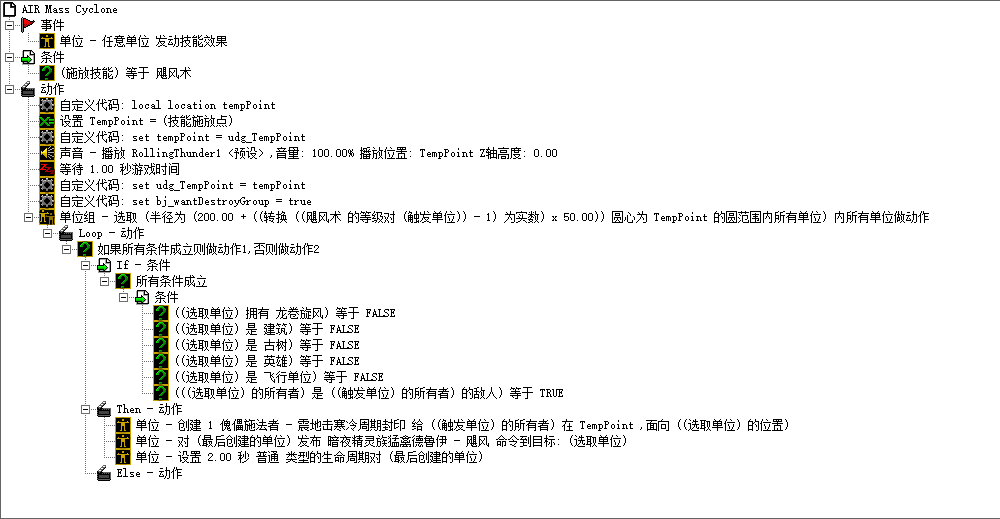

---

title: 大学学习之路的总结
date: 2017/3/20 15:18:48 
tags: 感悟
categories:
- ✿ 听风的思考
- 思考与墨迹

---

我的大学在独处与闲逛中度过了曲折的大一，那时候单凭一股热情与对CS的向往，**head first**的这学学，那学学，浪费了许多时光在无谓的操作上，当然在段时光中我也在思考**How**怎么做的哲学问题。

如同被积函数随积分区域的增长不断累积一样，经验也在不断的累积，小鲜肉在这锅油里炸成了老油条，懂了许多曲径可以通幽处。

一个比较有意思的例子是广东工业大学教务管理系统的[电信入口](http://jwgldx.gdut.edu.cn)，大一宿舍内拉AD（电信网络，相比于校园网，访问校园网的速度会明显慢一些）的我，在选课高峰时，基本上抢不过拉校园网的小伙伴，但后面发现是有这么个被冷落的电信入口，是很少人发现的曲径。

<!--more-->

## Enviroment ##
学习东西的时候，必须有一个好的学习环境，和志同道合的人一起交流，才有相同的话题，有相同目标的人在一起就能相互促进，不然简直就是对牛弹琴。人与人之间是会相互影响的，也就是老师们总结的**宿舍生态系统**理论。

不管做什么事情，可以有很多可以找到你的“道友”：
- **跑步**，去操场，跑内环。
- **读英语**，那么你应该早上七点的时候去图书馆下的空地上晨读，在那里不参与、不朗读会变得有点不合群。
- **做实验、做开发**的去参加学院的学生创新团队，那里有有经验的师兄、老师做指导。
- **做管理**多去社团锻炼，那里有比较好的机会接触更多的人。
- **背单词**，有个叫扇贝单词，里面有一个背单词小组，每天背完单词后打卡，和队友相互鼓励。
- **听歌**，有个网易云音乐，可以与人共享歌单，很容易就能发现你喜欢的那种类型的歌。

总结起来就是两个字：扎堆。

## Interest ##
> **interest**: state of wanting to learn or know about something; curiosity; concern 

培养兴趣极其重要，

我对计算机编程的喜爱最早是从一款**war craft 3(魔兽争霸3)**开始的，这个游戏在此前十分的热门火爆（相信很多人都玩过或有所耳闻），可玩性也很高，最关键的游戏团队在开发了一款强大的地图编辑器**WorldEditor(WE, 世界编辑器)**，

窗口式的可视化编辑环境下（类似于下面），我开始了人生第一次编程（虽然是Trigger），从此我对编程植下很深的羁绊。有兴趣的可以去了解或研究下。

x

## Resource ##
在现在的社会环境下，学习资源爆炸式增长，但不幸的是基本上资源的质量是参差不齐的，有些资料可能只会起到误导作用，所以我的建议是**广纳百家之言**，见多识广，有自己的世界观之后，看什么才会有个立场。

在大学的打滚历程中我总结出如下一些学习资源，仅供参考：

### Tutorial Web ###
初学者网站，下面的codecademy网站是为数不多的好网站，
- codecademy [(https://www.codecademy.com/)](https://www.codecademy.com/)

关于这个网站，有几点是需要注意的：
- 很遗憾，这个网站是全英，但这里使用的英语基本是简单的英语，使用起来除了克服心理压力，其他都还好。
- 里面配套的练习应该跟着去做，只有动手才能学好编程，这是不可否认的真理。
- 在这个网站中有好几个方面的教程，我个人推荐的学习顺序如下，当然只对于基本零基础的新手而言的
    - HTML & CSS
    - JavaScript
    - jQuery
    - PHP
    - Python
    - Ruby
    - Learn APIs
- 这个网站面向入门者，所以比较简单易懂，但深度也有所欠缺，所以在有入门的底子可以去学其他的课程。

此外我还想推荐两个网站：
1. codecombat（[http://cn.codecombat.com/](http://cn.codecombat.com/)）作为比较喜欢玩游戏的码农，还是想给同道中人推荐一些比较有意思的网站。这是一个专门给码农们玩的游戏，里面的操作基本靠代码完成，英雄走两步都得写个代码，你说六不六。

2. visualgo（[http://zh.visualgo.net/](http://zh.visualgo.net/)）这个是新加坡国立大学 Steven Halim 博士创作的一个数据结构可视化演示平台。初学者必备！

### Video ###
现在回望，我很庆幸活在Mooc（大规模开放在线课堂）泛滥的时代。大学期间，我专业知识的起步很多都是在视频授课中建立的。

如下介绍几个经常逛的Mooc网站：

- Coursera[(www.coursera.org)](http://www.coursera.org)
- edX[(www.edx.org)](http://www.edx.org)
- 学堂在线[(www.xuetangx.com)](http://www.xuetangx.com)
- MIT[(ocw.mit.edu)](http://ocw.mit.edu)
- 斯坦福[(www.stanford.edu)](http://www.stanford.edu)
- 网易公开课[(open.163.com)](http://open.163.com)

关于如上网站，有几点是需要注意的：
- 如上的Mooc网站中有很多基础课程（如微积分等），可以配合大学课堂的课程共同学习。
- 学习一门课程时应该配套的练习与讨论，不要小瞧了这些练习，有一些是很难的（有一门机器学习的练习我被虐了几个月。。。不堪回首。。。）
- 积极参与讨论与反馈，因为视频授课是比较单向。只有参与讨论才能理解得更加深刻。
- 在这些课程中有中国国内大学的Mooc和国外的Mooc，不要带有偏见的眼光区别看待。
- 关于英文课程，如果英文水平比较差的应该尽早找到视频对应的中文字幕，而不是鼓励自己“顺便学英文”，因为这是很伤积极性的。

#### Others ####
在CS行业中，有一些比较特殊的授课视频，这些是培训视频。由于这个行业的特殊性（暴利，高薪酬。一些非本行业经过一定培训也可从事开发工作），所以我们这些初学者可以有令一种学习资源———IT培训机构的培训教学视频。

- 某培训机构[(http://www.itcast.cn/)](http://www.itcast.cn/)

上述的网站中可以拿到免费全集的培训视频，记得下载源码与讲义以便对照学习。

需要注意的是，由于培训机构的商业性（罪恶的资本性），在视频中会存在比较大的个人偏见，而且极可能存在教学质量参差不齐的情况（因为授课老师不一定都很高明）。

（亲测，上述网站中的质量还比较OK的）

无论如果这是一个比较大的学习资源，只需记住我们的目标是学到东西即可。

### Books ###
书籍自古都是知识传递最主要的工具，但这种东西是无法十分有能动性的传递，需要，当然我个人的观点而言，看书学东西也是一件费力不讨好的事。主要因为现在可选择的书有很多，想在茫茫书海中找到几本有价值的书并不容易，看书还没有一种比较有效的体系方法，经常是看到一半还是不得要领。

下面将介绍一些我自己读书的经验：

选书上，一般我坚持是看书要看经典，看比较全，比较厚的那种，至少一点：会比较饱满。
黑皮书———机械工业出版社出版的计算机科学丛书———在不知道看什么书的情况下，可以首选，因为这些

如上的是丛书，丛书一般来说都是讲都比较优秀的书边排在一起的
  
除了这些丛书之外，可以参考一下一些大牛给出的书单参考，如下，当然需要注意的是，这些大佬们开出这些书单的目的和依据。不同书单的针对性会不同，但如果和自己的领域方向相同的，那么这种书单肯定差不多哪去。

**刘未鹏**：

1. Code: The Hidden Language of Computer Hardware and Software （《编码的奥秘》）
1. Computer System: A Programmer’s Perspective （《深入理解计算机系统》） / Windows via C/C++ （《Windows核心编程》 / 《程序员的自我修养》
1. Code Complete 2（《代码大全》）/ The Pragmatic Programmer （《程序员修炼之道》，我也把这本书称为《代码小全》）
1. Programming Pearls （《编程珠玑》） / Algorithms / Algorithm Design / 《编程之美》
1. The C Programming Language
1. The C++ Programming Language / Programming: Principles and Practice Using C++ / Accelerated C++
1. The Structure and Interpretation of Computer Programs （《计算机程序的构造和解释》）
1. Clean Code / Implementation Patterns
1. Design Patterns （《设计模式》） / Agile Software Development, Principles, Patterns, and Practices
1. Refactoring （《重构》）

**云风**（中国游戏编程先行者，前网易游戏部门资深程序员，简悦创始人）：

如果面试，我会挑以下的我自己读过的书，让人选择他也读过的部分，再了解他对这些书的理解。这些书其实本质上就是两类，对所面对的东西（程序语言也好，操作系统也好，底层设施也好）本身的理解程度。以及另一类：对设计思想和原则的理解：

1. C++编程思想
1. Effective C++
1. 深度探索C++对象模型
1. C++语言的设计和演化
1. C专家编程
1. C陷阱与缺陷
1. C语言接口与实现
1. Lua程序设计
1. Linkers and Loaders
1. COM本质论
1. Windows核心编程
1. 深入解析Windows操作系统
1. 程序员修炼之道
1. 代码大全
1. UNIX编程艺术
1. 设计模式
1. 代码优化：有效使用内存
1. 深入理解计算机系统
1. 深入理解LINUX内核
1. TCP/IP 详解

**冯大辉**（丁香园CTO，贝塔咖啡创始人）：

1. 软件随想录
1. 黑客与画家
1. 重来
1. UNIX编程艺术
1. 编程人生

**洪强宁**（豆瓣技术总监）：

StackOverflow上有一个程序员必读书单帖子，这里仅列出top10，更多参考这里。

1. Code Complete 2
1. The Mythical Man-Month （《人月神话》）
1. Code: The Hidden Language of Computer Hardware and Software （《编码的奥秘》）
1. TAOCP （不解释）
1. The Pragmatic Programmer （《程序员修炼之道》）
1. Design Patterns （《设计模式》）
1. The Structure and Interpretation of Computer Programs （《计算机程序的构造和解释》）
1. Refactoring （《重构》）
1. The C Programming Language
1. Introduction to Algorithms （《算法导论》）

**郑昀**（窝窝团研发副总裁）：

工程师入门：
1. Code Complete 2
1. 程序员修炼之道
1. 深入理解计算机系统
1. 工程师升级：
1. 设计模式
1. 重构——改善既有代码的设计
1. 工程师转型：
1. 快速软件开发——有效控制与完成进度计划
1. 人月神话
1. IT项目管理那些事儿
1. 软件随想录
1. 最后期限
1. 走出软件作坊
1. 你的灯亮着吗?——发现问题的真正所在

**张峥**（微软亚洲研究院副院长）：

1. Algorithms (by Sanjoy Dasgupta, Christos Papadimitriou and Umesh Vazirani)
1. Data Structure and Algorithms
1. The C Programming Language
1. The Design of the UNIX Operating System
1. Compilers （龙书）
1. Computer Architecture: A Quantitative Approach
1. Flow
1. Outliers (why hard work and luck are both important)

**邹欣**（MSRA创新工程中心首席研发经理）：
关于创新的书籍(http://book.douban.com/doulist/1253169/):

1. The Myths of Innovation
1. The Innovator’s Dilemma
1. The Innovator’s Solution
1. Crossing the Chasm
1. Inside Intuit
1. 盛田昭夫
1. 杰克·韦尔奇自传
1. 梦断代码
1. Innovation
1. 浪潮之巅

### 图书馆 ###
我校的图书馆藏书丰富，基本上很多书想找的书都能在图书馆找到，但是图书馆有并不代表你能借得到，因为有可能被其他「志同道合」的人抢先一步借走了。有些领域的「入门必读」书那么热门，但图书馆能借的也就十来本，所以辛苦跑一趟图书馆却发现被人借光了那也是很常见的事。

下面，有几条经验之谈希望可以帮到你：
1. 如果是好书，建议就去「某宝」或「某东」买了吧，因为**好书是值得珍藏的**。当然，要买就买正版书籍，拒绝盗版。相对于出则几千上万的进口原版书而言，国内书籍的价格还是很便宜的，加上电商逢年过节各种打折促销的，价格其实已经高不到哪去了。不过最主要的，这也是出于对著书作者的一种支持与尊重。
2. 在广工图书馆的六楼东北角有一处**「英文原版图书藏书角」**，里面收藏了图书馆很多英文原版图书，且每本书基本就只收藏一本，虽少而精，基本我想找的计算机类的**好的英文原版书**都能找到，所以很是珍贵。但遗憾是，或很少人知晓这个偏远的角落，或谈「英」色变，此处鲜有人迹，所以在借到手时能感觉到书很新**（这很是让人心动，因为这好像是一个属于自己的小书库的感觉）**。在找不到想要的书籍的情况下，可以去这个地方淘淘金，或者可以发现意想不到的惊喜。
3. 在不想买书，又不想看英语书的情况下，还可以在每层楼的**「热门图书角」**碰碰运气，有时候图书馆系统上显示书没有被借走，却又在书架上找不到时，很可能就是被管理员放在了「热门图书角」里了。

### Reading Notes ###
在看书的过程中，我比较建议养成做笔记的好习惯。笔记可以。但在我看来这时候那个小本本写一些小摘抄就没那么必要了。最好的是做一些电子笔记。原因如下：

- 格式不变，不能做图片、超链接等富文本信息。
- 代码附录不便捷
- 整理不方便

这里推荐一些电子笔记软件作为参考：
- **OneNote**，微软的亲儿子，在文档的编辑和格式的支持上比较全，特别是**公式支持得好**（这一点比较重要，在记录到一些公式时，可以让你毫不费劲的撸出来！）
- **为知、印象**，有自己特色的电子笔记，跨平台

除此之外，（像我现在这样）自己搭一个博客或使用第三方的博客平台做笔记也是极好的。不过自己搭建一个比较麻烦或者说比较折腾，不建议入门的孩纸去吓捣腾，使用第三方的博客平台会便捷许多，如下：

- CSDN 博客（([blog.csdn.net](http://blog.csdn.net)）
- 博客园（[www.cnblogs.com](http://www.cnblogs.com)）

都是一些比较好的博客门户。而博客上出了做一些笔记之外还可以写些教程、DEBUG记录等供他们参考，这样也可以给自己的网站赢得一些人气。

### Github ###
很多工程的代码都是直接存放在这个网站上并公开，一个比较屌的例子是Linux的源码就是存放在这里的。

这在平台上可以找到许多的项目的源码，而这些项目百度爬虫是不爬取的，也就是说直接百度搜是搜索不到的。

比如说，你想做一个图像处理的项目，在做这个项目之前你可以在Github上搜索`opencv`等关键字，找些优秀的项目或案例去参考，查看别人的源码，可以学到别人的编程方式，问题的可能实现方法，编程时应该注意的问题，这会让你少走许多弯路。

看一天的**优秀源码**绝对比自己撸一天的乱糟糟的代码要有效率得多，特别是初学者。

如果还不会使用Git的，推荐如下教程网站进行学习：

- 廖雪峰的官方网站[(http://www.liaoxuefeng.com/)](http://www.liaoxuefeng.com/)
- Git参考手册中文版[(http://gitref.org/zh/)](http://gitref.org/zh/)
- Git官方网站[(http://git-scm.com/book/zh/v1)](http://git-scm.com/book/zh/v1)

### Community ###
社区网站，这些网站一般会是我们增长见识的地方，这些社区会有很多项目、软件的推荐，各种动态消息的推送，干货的促销，大牛的心得巨著。

- 图灵社区[(http://www.ituring.com.cn/)](http://www.ituring.com.cn/)
- 果壳网[(http://www.guokr.com/scientific/)](http://www.guokr.com/scientific/)
- 开源社区中国[(http://www.oschina.net/news/)](http://www.oschina.net/news/)
- ITeye[(http://www.iteye.com/)](http://www.iteye.com/)
- FreeCode[(http://freecode.com/)](http://freecode.com/)
- Sourceforge[(http://sourceforge.net/)](http://sourceforge.net/)
- launchpad[(https://launchpad.net/)](https://launchpad.net/)

对于这些社区的消息，如果每天花时间去浏览其实也不是很划算，我的方案是做一个爬虫，将这些消息做成推送发到我的手机中进行浏览。

### Others ###
上述所讲的资源均是“静态”的学习资料，需要你用心的去发掘并学习，但不应该忽略的是人具有能动性的存在，如果可以抱住一个大神的腿那是相当极好的！

拉一个活人，给你问是最好的

当然除了身边认识的之外，也可以去求教网上、国外的大牛，但是很显然得到回应的概率会不那么理想。而求教素未谋面的人，是需要一些需要注意的，这些将在后文会给出建议。

 
如何与高手(Gurus)打交道？———P17
- 首先想清楚你想问什么
- 在弄清楚自己想找什么，可以先去FAQ问答中搜寻答案
- 如果你真的想找个人问问，那么可以去相应的项目组、官网论坛、那些较大概率可能遇到高手的地方
- 注意自己的态度与语气，因为你在向别人请教，而非使唤别人做事。用最简洁的语言表达你的东西。
- 如果是期望指定某人回答你的问题，可能需要有些耐性，因为他可能很忙
- 别忘了感谢那些回应你的人。
关于这个话题，作者给出的应该是“**如何提问题**”或者说“**提问的艺术**”的解答。当然这是在形成自己学习能力时，必须学会的一门技巧。从我自己的经验上来讲，如果是“如何提问”这件事的话，我认为还可以有如下一些建议：
- 给自己的求助起一个简洁、富含信息的标题（如在贴吧的帖子标题），让那些在逛贴吧的高手们能一眼看出你想求助的是什么，然后点进来。
- 在提问时尽可能的提供你所遇到问题的具体信息，如在编程时遇到的问题，应该提供当前的工作环境，软件版本，所用工具，实现的一些过程。
- 编程时出现的问题，应该贴出自己的一些关键代码（全部代码短的也可以，长的应该给下载链接就行了），并用简洁的语言说明自己的实现思路。
- 在提问题时，可以提供自己之前尝试过的一些解决方案（即时失败了）
- 对于你的问题，可能别人也想知道，贴出来分享给大家。如果看到别人在问一些你可能知道的问题，也记得去答两句。
- 在中国的新环境下，问问题除了百度，还能搜个相关QQ群加进去、搜个贴吧、知乎进去翻翻、，当然能找到梯子的可以去外面问问。